# 🎨 Diagramas y esquemas visuales

Diagramas y esquemas visuales para facilitar la comprensión de IA + TIA Portal.

---

## 📑 Tabla de contenido

- [Diagramas Mermaid](#diagramas-mermaid)
- [Diagramas ASCII](#diagramas-ascii)
- [Resumen de diagramas](#resumen-de-diagramas)

---

## 🎨 Diagramas Mermaid

[Ver diagramas Mermaid interactivos](./README.md)

**27 diagramas Mermaid:**
- Arquitectura general (3)
- Flujo de trabajo (2)
- Arquitectura de proyectos (3)
- Máquinas de estado (3)
- Roadmap de aprendizaje (2)
- Matriz de decisión (2)
- Diagramas de flujo de tutoriales (3)
- Casos de uso (2)
- Comparativas (2)
- Esquemas técnicos (3)
- Badges (2)
- Métricas (2)

---

## 🖼️ Diagramas ASCII

[Ver diagramas ASCII detallados](./ascii-art.md)

**15 diagramas ASCII:**
- Arquitectura general (2)
- Máquinas de estado (3)
- Flujo de trabajo (1)
- Roadmap de aprendizaje (1)
- Matriz de decisión (1)
- Comparativas (1)
- Casos de uso (2)
- Badges (1)
- Métricas (2)
- Esquemas técnicos (2)

---

## 📊 Resumen de diagramas

---

## 🏗️ Arquitectura general

### Arquitectura IA + TIA Portal

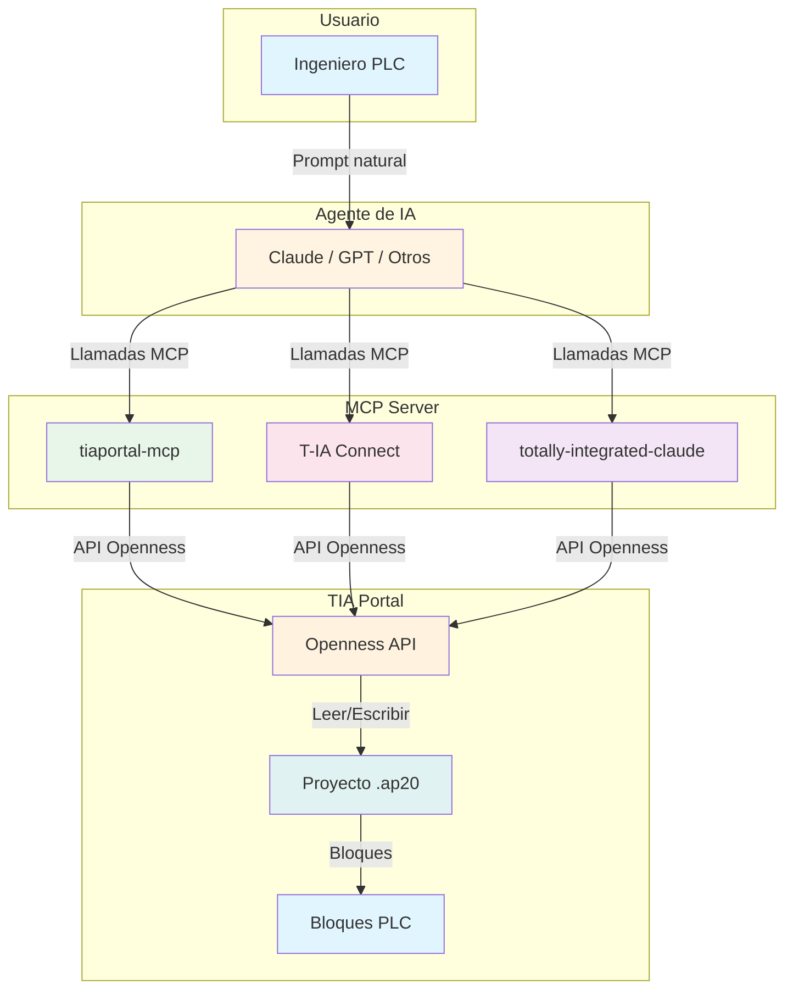
```mermaid
graph TB
    subgraph "Usuario"
        A[Ingeniero PLC]
    end

    subgraph "Agente de IA"
        B[Claude / GPT / Otros]
    end

    subgraph "MCP Server"
        C[tiaportal-mcp]
        D[T-IA Connect]
        E[totally-integrated-claude]
    end

    subgraph "TIA Portal"
        F[Openness API]
        G[Proyecto .ap20]
        H[Bloques PLC]
    end

    A -->|Prompt natural| B
    B -->|Llamadas MCP| C
    B -->|Llamadas MCP| D
    B -->|Llamadas MCP| E
    C -->|API Openness| F
    D -->|API Openness| F
    E -->|API Openness| F
    F -->|Leer/Escribir| G
    G -->|Bloques| H

    style A fill:#e1f5ff
    style B fill:#fff4e1
    style C fill:#e8f5e9
    style D fill:#fce4ec
    style E fill:#f3e5f5
    style F fill:#fff3e0
    style G fill:#e0f2f1
    style H fill:#e1f5ff
```

### Flujo de datos completo

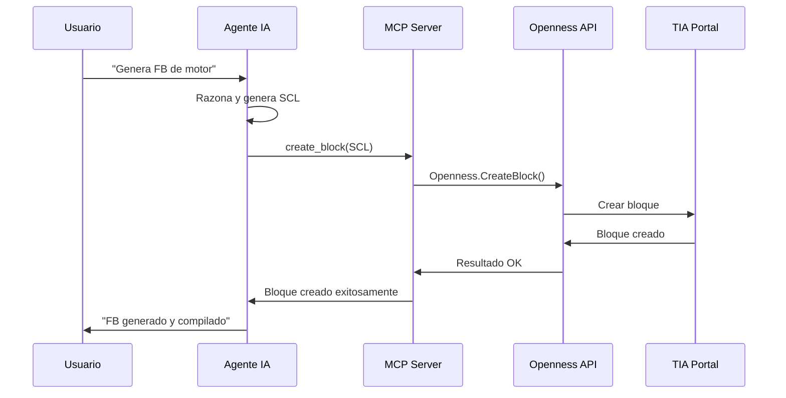
```mermaid
sequenceDiagram
    participant U as Usuario
    participant AI as Agente IA
    participant MCP as MCP Server
    participant API as Openness API
    participant TIA as TIA Portal

    U->>AI: "Genera FB de motor"
    AI->>AI: Razona y genera SCL
    AI->>MCP: create_block(SCL)
    MCP->>API: Openness.CreateBlock()
    API->>TIA: Crear bloque
    TIA->>API: Bloque creado
    API->>MCP: Resultado OK
    MCP->>AI: Bloque creado exitosamente
    AI->>U: "FB generado y compilado"
```

---

## 🔄 Flujo de trabajo

### Flujo de trabajo típico

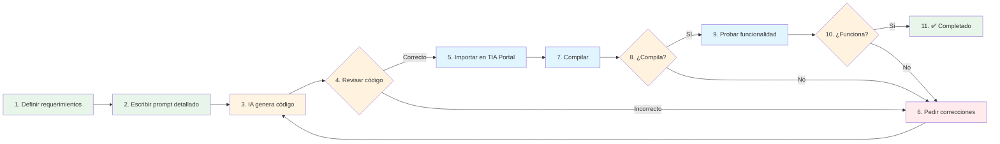
```mermaid
graph LR
    A[1. Definir requerimientos] --> B[2. Escribir prompt detallado]
    B --> C[3. IA genera código]
    C --> D{4. Revisar código}
    D -->|Correcto| E[5. Importar en TIA Portal]
    D -->|Incorrecto| F[6. Pedir correcciones]
    F --> C
    E --> G[7. Compilar]
    G --> H{8. ¿Compila?}
    H -->|Sí| I[9. Probar funcionalidad]
    H -->|No| F
    I --> J{10. ¿Funciona?}
    J -->|Sí| K[11. ✅ Completado]
    J -->|No| F

    style A fill:#e8f5e9
    style B fill:#e8f5e9
    style C fill:#fff4e1
    style D fill:#fff3e0
    style E fill:#e1f5ff
    style F fill:#ffebee
    style G fill:#e1f5ff
    style H fill:#fff3e0
    style I fill:#e1f5ff
    style J fill:#fff3e0
    style K fill:#e8f5e9
```

### Ciclo de iteración

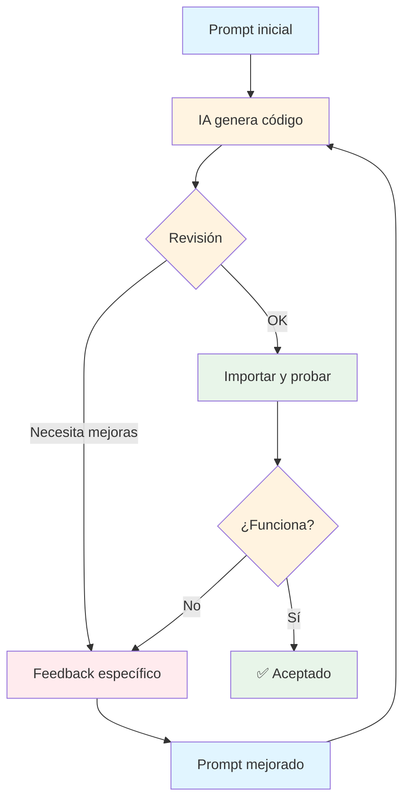
```mermaid
graph TD
    A[Prompt inicial] --> B[IA genera código]
    B --> C{Revisión}
    C -->|OK| D[Importar y probar]
    C -->|Necesita mejoras| E[Feedback específico]
    E --> F[Prompt mejorado]
    F --> B
    D --> G{¿Funciona?}
    G -->|Sí| H[✅ Aceptado]
    G -->|No| E

    style A fill:#e1f5ff
    style B fill:#fff4e1
    style C fill:#fff3e0
    style D fill:#e8f5e9
    style E fill:#ffebee
    style F fill:#e1f5ff
    style G fill:#fff3e0
    style H fill:#e8f5e9
```

---

## 🏛️ Arquitectura de proyectos

### tiaportal-mcp

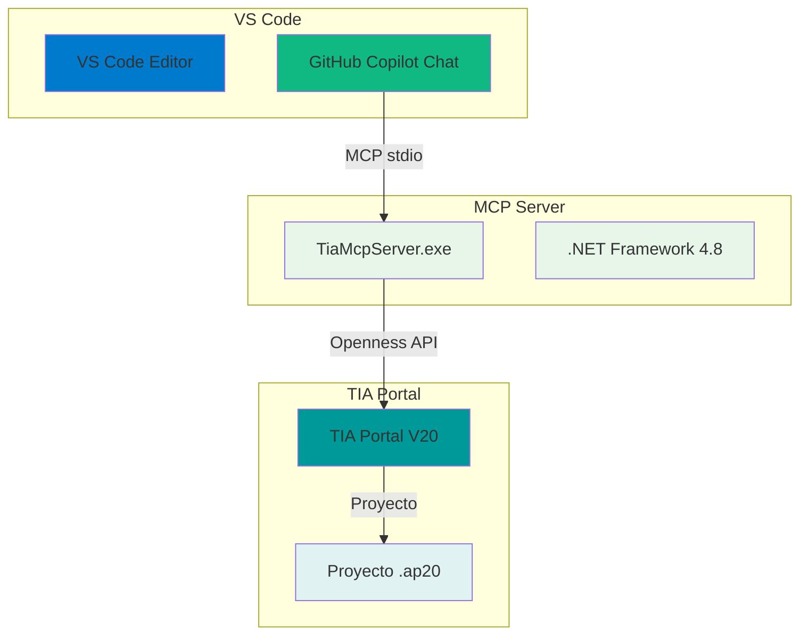
```mermaid
graph TB
    subgraph "VS Code"
        A[VS Code Editor]
        B[GitHub Copilot Chat]
    end

    subgraph "MCP Server"
        C[TiaMcpServer.exe]
        D[.NET Framework 4.8]
    end

    subgraph "TIA Portal"
        E[TIA Portal V20]
        F[Proyecto .ap20]
    end

    B -->|MCP stdio| C
    C -->|Openness API| E
    E -->|Proyecto| F

    style A fill:#007acc
    style B fill:#10b981
    style C fill:#e8f5e9
    style D fill:#e8f5e9
    style E fill:#009999
    style F fill:#e0f2f1
```

### T-IA Connect

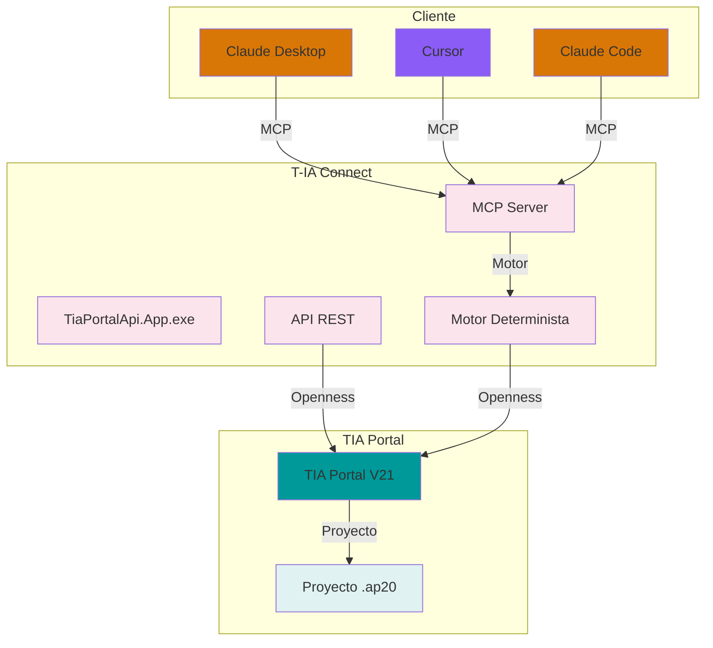
```mermaid
graph TB
    subgraph "Cliente"
        A[Claude Desktop]
        B[Cursor]
        C[Claude Code]
    end

    subgraph "T-IA Connect"
        D[TiaPortalApi.App.exe]
        E[Motor Determinista]
        F[API REST]
        G[MCP Server]
    end

    subgraph "TIA Portal"
        H[TIA Portal V21]
        I[Proyecto .ap20]
    end

    A -->|MCP| G
    B -->|MCP| G
    C -->|MCP| G
    G -->|Motor| E
    F -->|Openness| H
    E -->|Openness| H
    H -->|Proyecto| I

    style A fill:#d97706
    style B fill:#8b5cf6
    style C fill:#d97706
    style D fill:#fce4ec
    style E fill:#fce4ec
    style F fill:#fce4ec
    style G fill:#fce4ec
    style H fill:#009999
    style I fill:#e0f2f1
```

### totally-integrated-claude

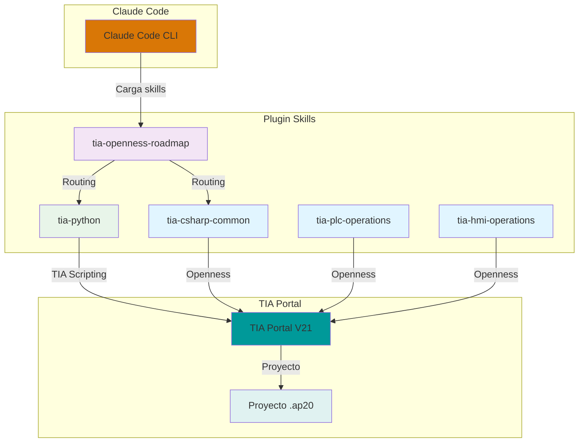
```mermaid
graph TB
    subgraph "Claude Code"
        A[Claude Code CLI]
    end

    subgraph "Plugin Skills"
        B[tia-openness-roadmap]
        C[tia-python]
        D[tia-csharp-common]
        E[tia-plc-operations]
        F[tia-hmi-operations]
    end

    subgraph "TIA Portal"
        G[TIA Portal V21]
        H[Proyecto .ap20]
    end

    A -->|Carga skills| B
    B -->|Routing| C
    B -->|Routing| D
    C -->|TIA Scripting| G
    D -->|Openness| G
    E -->|Openness| G
    F -->|Openness| G
    G -->|Proyecto| H

    style A fill:#d97706
    style B fill:#f3e5f5
    style C fill:#e8f5e9
    style D fill:#e1f5ff
    style E fill:#e1f5ff
    style F fill:#e1f5ff
    style G fill:#009999
    style H fill:#e0f2f1
```

---

## ⚙️ Máquinas de estado

### Máquina de estados de motor

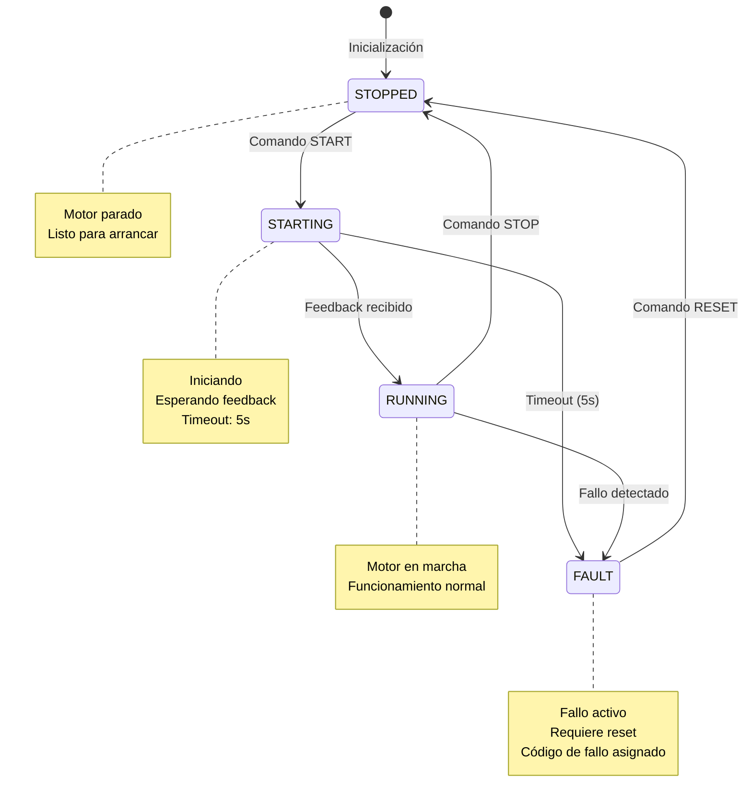
```mermaid
stateDiagram-v2
    [*] --> STOPPED: Inicialización
    STOPPED --> STARTING: Comando START
    STARTING --> RUNNING: Feedback recibido
    STARTING --> FAULT: Timeout (5s)
    RUNNING --> STOPPED: Comando STOP
    RUNNING --> FAULT: Fallo detectado
    FAULT --> STOPPED: Comando RESET

    note right of STOPPED
        Motor parado
        Listo para arrancar
    end note

    note right of STARTING
        Iniciando
        Esperando feedback
        Timeout: 5s
    end note

    note right of RUNNING
        Motor en marcha
        Funcionamiento normal
    end note

    note right of FAULT
        Fallo activo
        Requiere reset
        Código de fallo asignado
    end note
```

### Máquina de estados de filtro

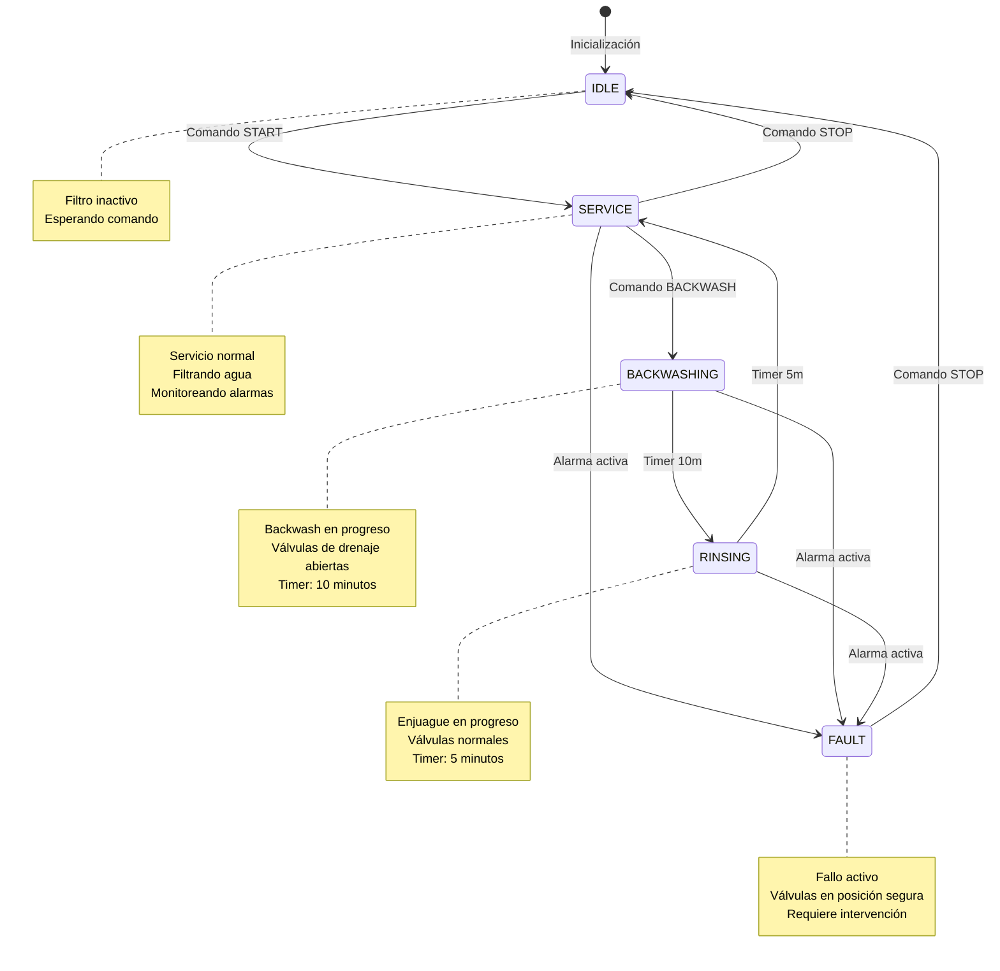
```mermaid
stateDiagram-v2
    [*] --> IDLE: Inicialización
    IDLE --> SERVICE: Comando START
    SERVICE --> BACKWASHING: Comando BACKWASH
    BACKWASHING --> RINSING: Timer 10m
    RINSING --> SERVICE: Timer 5m
    SERVICE --> IDLE: Comando STOP
    SERVICE --> FAULT: Alarma activa
    BACKWASHING --> FAULT: Alarma activa
    RINSING --> FAULT: Alarma activa
    FAULT --> IDLE: Comando STOP

    note right of IDLE
        Filtro inactivo
        Esperando comando
    end note

    note right of SERVICE
        Servicio normal
        Filtrando agua
        Monitoreando alarmas
    end note

    note right of BACKWASHING
        Backwash en progreso
        Válvulas de drenaje abiertas
        Timer: 10 minutos
    end note

    note right of RINSING
        Enjuague en progreso
        Válvulas normales
        Timer: 5 minutos
    end note

    note right of FAULT
        Fallo activo
        Válvulas en posición segura
        Requiere intervención
    end note
```

### Máquina de estados de válvula

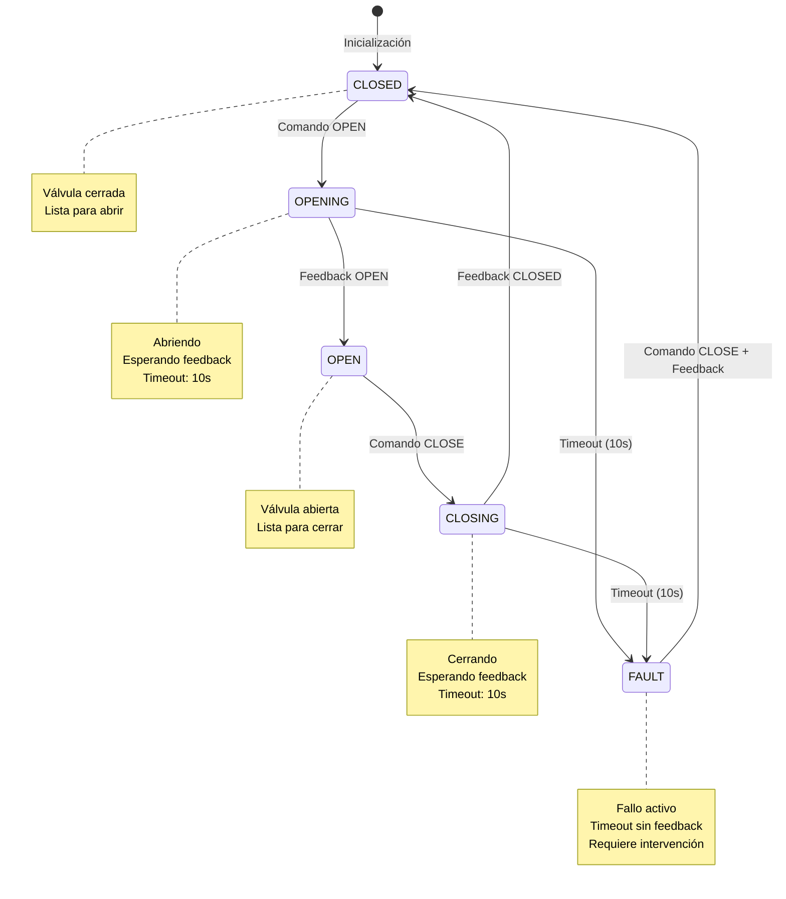
```mermaid
stateDiagram-v2
    [*] --> CLOSED: Inicialización
    CLOSED --> OPENING: Comando OPEN
    OPENING --> OPEN: Feedback OPEN
    OPENING --> FAULT: Timeout (10s)
    OPEN --> CLOSING: Comando CLOSE
    CLOSING --> CLOSED: Feedback CLOSED
    CLOSING --> FAULT: Timeout (10s)
    FAULT --> CLOSED: Comando CLOSE + Feedback

    note right of CLOSED
        Válvula cerrada
        Lista para abrir
    end note

    note right of OPENING
        Abriendo
        Esperando feedback
        Timeout: 10s
    end note

    note right of OPEN
        Válvula abierta
        Lista para cerrar
    end note

    note right of CLOSING
        Cerrando
        Esperando feedback
        Timeout: 10s
    end note

    note right of FAULT
        Fallo activo
        Timeout sin feedback
        Requiere intervención
    end note
```

---

## 🎓 Roadmap de aprendizaje

### Roadmap visual de tutoriales

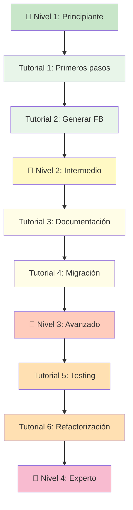
```mermaid
graph TD
    A[🥉 Nivel 1: Principiante] --> B[Tutorial 1: Primeros pasos]
    B --> C[Tutorial 2: Generar FB]
    C --> D[🥈 Nivel 2: Intermedio]
    D --> E[Tutorial 3: Documentación]
    E --> F[Tutorial 4: Migración]
    F --> G[🥇 Nivel 3: Avanzado]
    G --> H[Tutorial 5: Testing]
    H --> I[Tutorial 6: Refactorización]
    I --> J[💎 Nivel 4: Experto]

    style A fill:#c8e6c9
    style B fill:#e8f5e9
    style C fill:#e8f5e9
    style D fill:#fff9c4
    style E fill:#fffde7
    style F fill:#fffde7
    style G fill:#ffccbc
    style H fill:#ffe0b2
    style I fill:#ffe0b2
    style J fill:#f8bbd0
```

### Ruta de aprendizaje recomendada

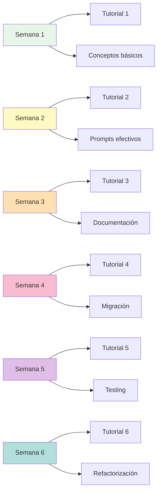
```mermaid
graph LR
    A[Semana 1] --> B[Tutorial 1]
    A --> C[Conceptos básicos]

    D[Semana 2] --> E[Tutorial 2]
    D --> F[Prompts efectivos]

    G[Semana 3] --> H[Tutorial 3]
    G --> I[Documentación]

    J[Semana 4] --> K[Tutorial 4]
    J --> L[Migración]

    M[Semana 5] --> N[Tutorial 5]
    M --> O[Testing]

    P[Semana 6] --> Q[Tutorial 6]
    P --> R[Refactorización]

    style A fill:#e8f5e9
    style D fill:#fff9c4
    style G fill:#ffe0b2
    style J fill:#f8bbd0
    style M fill:#e1bee7
    style P fill:#b2dfdb
```

---

## 🎯 Matriz de decisión

### Árbol de decisión visual

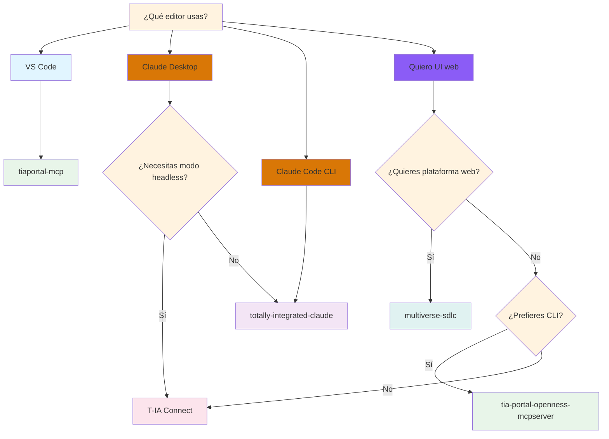
```mermaid
graph TD
    A[¿Qué editor usas?] --> B[VS Code]
    A --> C[Claude Desktop]
    A --> D[Claude Code CLI]
    A --> E[Quiero UI web]

    B --> F[tiaportal-mcp]

    C --> G{¿Necesitas modo headless?}
    G -->|Sí| H[T-IA Connect]
    G -->|No| I[totally-integrated-claude]

    D --> I

    E --> J{¿Quieres plataforma web?}
    J -->|Sí| K[multiverse-sdlc]
    J -->|No| L{¿Prefieres CLI?}
    L -->|Sí| M[tia-portal-openness-mcpserver]
    L -->|No| H

    style A fill:#fff3e0
    style B fill:#e1f5ff
    style C fill:#d97706
    style D fill:#d97706
    style E fill:#8b5cf6
    style F fill:#e8f5e9
    style G fill:#fff3e0
    style H fill:#fce4ec
    style I fill:#f3e5f5
    style J fill:#fff3e0
    style K fill:#e0f2f1
    style L fill:#fff3e0
    style M fill:#e8f5e9
```

### Matriz de decisión por caso de uso

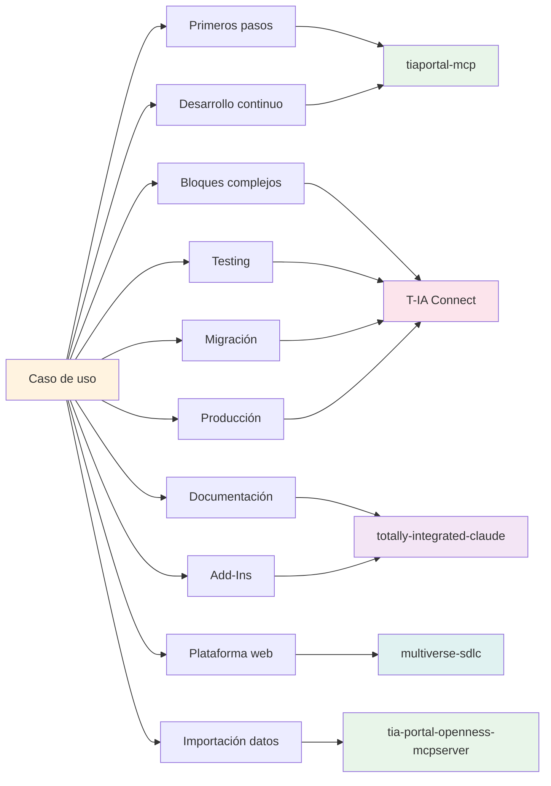
```mermaid
graph LR
    A[Caso de uso] --> B[Primeros pasos]
    A --> C[Desarrollo continuo]
    A --> D[Bloques complejos]
    A --> E[Documentación]
    A --> F[Testing]
    A --> G[Migración]
    A --> H[Add-Ins]
    A --> I[Plataforma web]
    A --> J[Importación datos]
    A --> K[Producción]

    B --> L[tiaportal-mcp]
    C --> L
    D --> M[T-IA Connect]
    E --> N[totally-integrated-claude]
    F --> M
    G --> M
    H --> N
    I --> O[multiverse-sdlc]
    J --> P[tia-portal-openness-mcpserver]
    K --> M

    style A fill:#fff3e0
    style L fill:#e8f5e9
    style M fill:#fce4ec
    style N fill:#f3e5f5
    style O fill:#e0f2f1
    style P fill:#e8f5e9
```

---

## 📖 Diagramas de flujo de tutoriales

### Tutorial 1: Primeros pasos

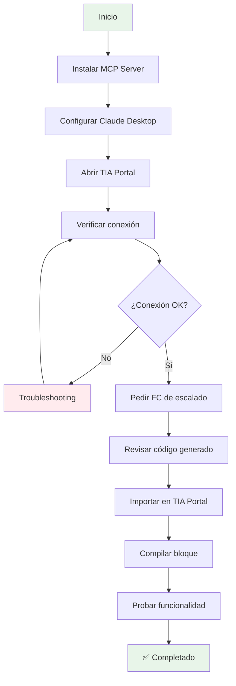
```mermaid
graph TD
    A[Inicio] --> B[Instalar MCP Server]
    B --> C[Configurar Claude Desktop]
    C --> D[Abrir TIA Portal]
    D --> E[Verificar conexión]
    E --> F{¿Conexión OK?}
    F -->|No| G[Troubleshooting]
    G --> E
    F -->|Sí| H[Pedir FC de escalado]
    H --> I[Revisar código generado]
    I --> J[Importar en TIA Portal]
    J --> K[Compilar bloque]
    K --> L[Probar funcionalidad]
    L --> M[✅ Completado]

    style A fill:#e8f5e9
    style M fill:#e8f5e9
    style G fill:#ffebee
```

### Tutorial 2: Generar FB complejo

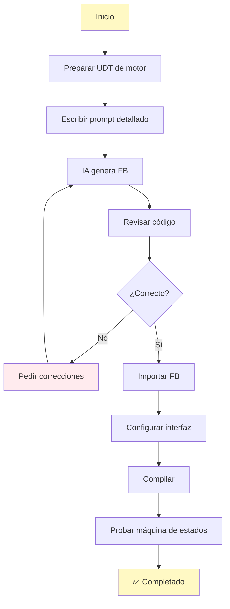
```mermaid
graph TD
    A[Inicio] --> B[Preparar UDT de motor]
    B --> C[Escribir prompt detallado]
    C --> D[IA genera FB]
    D --> E[Revisar código]
    E --> F{¿Correcto?}
    F -->|No| G[Pedir correcciones]
    G --> D
    F -->|Sí| H[Importar FB]
    H --> I[Configurar interfaz]
    I --> J[Compilar]
    J --> K[Probar máquina de estados]
    K --> L[✅ Completado]

    style A fill:#fff9c4
    style L fill:#fff9c4
    style G fill:#ffebee
```

### Tutorial 3: Documentación automática

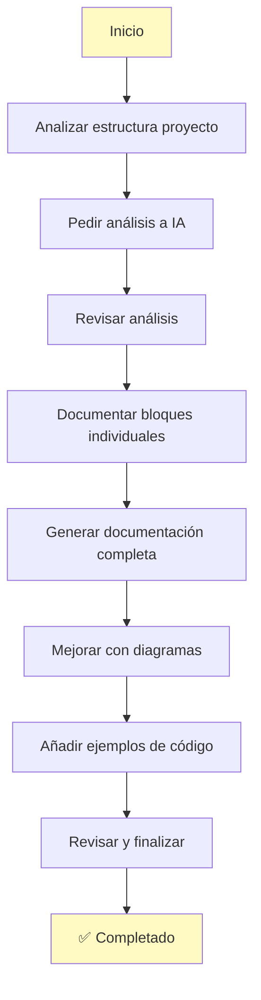
```mermaid
graph TD
    A[Inicio] --> B[Analizar estructura proyecto]
    B --> C[Pedir análisis a IA]
    C --> D[Revisar análisis]
    D --> E[Documentar bloques individuales]
    E --> F[Generar documentación completa]
    F --> G[Mejorar con diagramas]
    G --> H[Añadir ejemplos de código]
    H --> I[Revisar y finalizar]
    I --> J[✅ Completado]

    style A fill:#fff9c4
    style J fill:#fff9c4
```

---

## 🏭 Diagramas de casos de uso

### Línea de tratamiento de agua

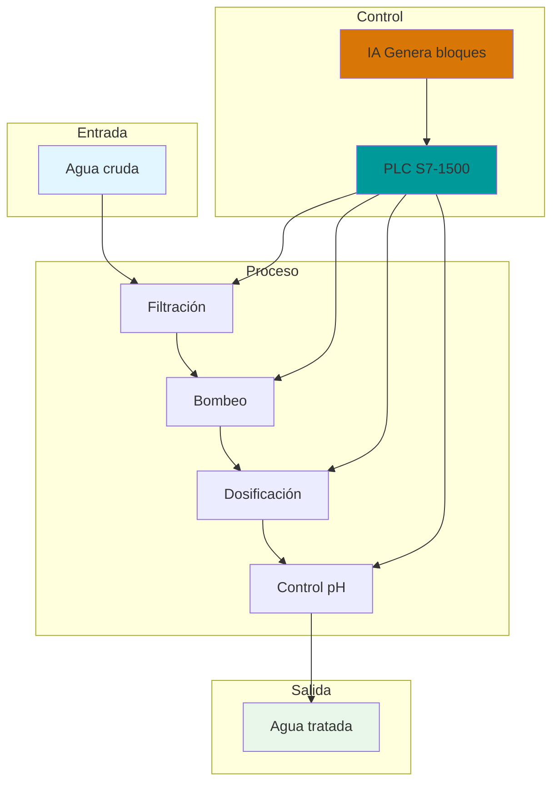
```mermaid
graph TB
    subgraph "Entrada"
        A[Agua cruda]
    end

    subgraph "Proceso"
        B[Filtración]
        C[Bombeo]
        D[Dosificación]
        E[Control pH]
    end

    subgraph "Salida"
        F[Agua tratada]
    end

    subgraph "Control"
        G[PLC S7-1500]
        H[IA Genera bloques]
    end

    A --> B
    B --> C
    C --> D
    D --> E
    E --> F

    G --> B
    G --> C
    G --> D
    G --> E

    H --> G

    style A fill:#e1f5ff
    style F fill:#e8f5e9
    style G fill:#009999
    style H fill:#d97706
```

### Sistema de transporte de cintas

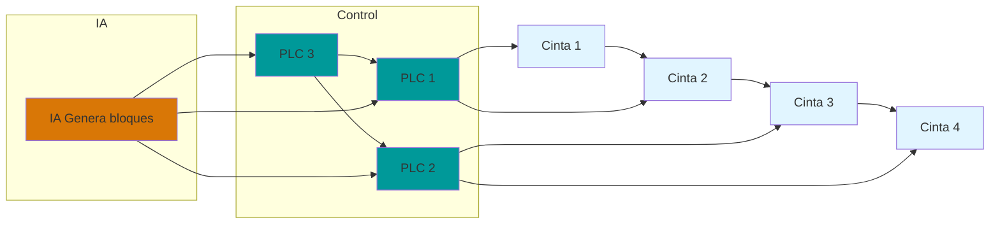
```mermaid
graph LR
    A[Cinta 1] --> B[Cinta 2]
    B --> C[Cinta 3]
    C --> D[Cinta 4]

    subgraph "Control"
        E[PLC 1]
        F[PLC 2]
        G[PLC 3]
    end

    subgraph "IA"
        H[IA Genera bloques]
    end

    E --> A
    E --> B
    F --> C
    F --> D
    G --> E
    G --> F

    H --> E
    H --> F
    H --> G

    style A fill:#e1f5ff
    style B fill:#e1f5ff
    style C fill:#e1f5ff
    style D fill:#e1f5ff
    style E fill:#009999
    style F fill:#009999
    style G fill:#009999
    style H fill:#d97706
```

---

## 📊 Comparativas visuales

### Comparativa de MCP Servers

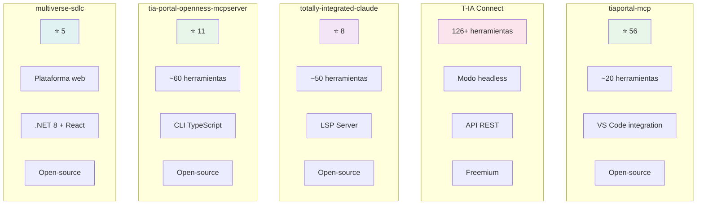
```mermaid
graph TB
    subgraph "tiaportal-mcp"
        A1[⭐ 56]
        A2[~20 herramientas]
        A3[VS Code integration]
        A4[Open-source]
    end

    subgraph "T-IA Connect"
        B1[126+ herramientas]
        B2[Modo headless]
        B3[API REST]
        B4[Freemium]
    end

    subgraph "totally-integrated-claude"
        C1[⭐ 8]
        C2[~50 herramientas]
        C3[LSP Server]
        C4[Open-source]
    end

    subgraph "tia-portal-openness-mcpserver"
        D1[⭐ 11]
        D2[~60 herramientas]
        D3[CLI TypeScript]
        D4[Open-source]
    end

    subgraph "multiverse-sdlc"
        E1[⭐ 5]
        E2[Plataforma web]
        E3[.NET 8 + React]
        E4[Open-source]
    end

    style A1 fill:#e8f5e9
    style B1 fill:#fce4ec
    style C1 fill:#f3e5f5
    style D1 fill:#e8f5e9
    style E1 fill:#e0f2f1
```

### Matriz de características

```mermaid
graph LR
    A[Característica] --> B[tiaportal-mcp]
    A --> C[T-IA Connect]
    A --> D[totally-integrated-claude]
    A --> E[tia-portal-openness-mcpserver]
    A --> F[multiverse-sdlc]

    B --> G[✅ Popularidad]
    C --> H[✅ Potencia]
    D --> I[✅ Aprendizaje]
    E --> J[✅ CLI]
    F --> K[✅ Plataforma web]

    style G fill:#e8f5e9
    style H fill:#fce4ec
    style I fill:#f3e5f5
    style J fill:#e8f5e9
    style K fill:#e0f2f1
```

---

## 🔧 Esquemas técnicos

### Esquema de conexión MCP

```mermaid
graph LR
    A[Claude Desktop] -->|stdio| B[MCP Server]
    B -->|Openness API| C[TIA Portal]
    C -->|Proyecto| D[.ap20]

    style A fill:#d97706
    style B fill:#e8f5e9
    style C fill:#009999
    style D fill:#e0f2f1
```

### Esquema de API REST

```mermaid
graph LR
    A[Cliente HTTP] -->|REST| B[T-IA Connect API]
    B -->|Openness| C[TIA Portal]
    C -->|Proyecto| D[.ap20]

    style A fill:#e1f5ff
    style B fill:#fce4ec
    style C fill:#009999
    style D fill:#e0f2f1
```

### Esquema de SignalR

```mermaid
graph LR
    A[Frontend React] -->|WebSocket| B[SignalR Hub]
    B -->|REST| C[Backend .NET]
    C -->|Openness| D[TIA Portal]

    style A fill:#61dafb
    style B fill:#5c2d91
    style C fill:#512bd4
    style D fill:#009999
```

---

## 🎨 Badges y iconos

### Badges de nivel

```mermaid
graph LR
    A[🥉 Principiante] --> B[🥈 Intermedio]
    B --> C[🥇 Avanzado]
    C --> D[💎 Experto]

    style A fill:#c8e6c9
    style B fill:#fff9c4
    style C fill:#ffccbc
    style D fill:#f8bbd0
```

### Badges de proyecto

```mermaid
graph LR
    A[🏆 Más popular] --> B[💪 Más potente]
    B --> C[🎓 Mejor para aprender]
    C --> D[🛠️ Mejor CLI]
    D --> E[🌐 Mejor plataforma web]
    E --> F[🚀 Mejor para producción]
    F --> G[🔒 Mejor seguridad]

    style A fill:#ffd700
    style B fill:#ff6b6b
    style C fill:#4ecdc4
    style D fill:#45b7d1
    style E fill:#96ceb4
    style F fill:#ffeaa7
    style G fill:#dfe6e9
```

---

## 📈 Métricas visuales

### Reducción de tiempo

```mermaid
graph TB
    A[Antes: 12 semanas] --> B[Después: 6 semanas]
    B --> C[Reducción: 50%]

    style A fill:#ffebee
    style B fill:#e8f5e9
    style C fill:#e1f5ff
```

### Mejora de calidad

```mermaid
graph TB
    A[Antes: 23 errores] --> B[Después: 2 errores]
    B --> C[Mejora: 91%]

    style A fill:#ffebee
    style B fill:#e8f5e9
    style C fill:#e1f5ff
```

---

## 📊 Resumen de diagramas

| Categoría | Mermaid | ASCII | Total |
|---|---|---|---|
| **Arquitectura** | 3 | 2 | 5 |
| **Flujo de trabajo** | 2 | 1 | 3 |
| **Proyectos** | 3 | 0 | 3 |
| **Máquinas de estado** | 3 | 3 | 6 |
| **Roadmap** | 2 | 1 | 3 |
| **Matriz de decisión** | 2 | 1 | 3 |
| **Tutoriales** | 3 | 0 | 3 |
| **Casos de uso** | 2 | 2 | 4 |
| **Comparativas** | 2 | 1 | 3 |
| **Técnicos** | 3 | 2 | 5 |
| **Badges** | 2 | 1 | 3 |
| **Métricas** | 2 | 2 | 4 |
| **TOTAL** | **27** | **15** | **42** |

---

## 💡 Cómo usar estos diagramas

### En GitHub

Los diagramas Mermaid se renderizan automáticamente en GitHub. Simplemente:

1. Copia el código del diagrama
2. Pégalo en tu archivo Markdown
3. GitHub lo renderiza automáticamente

### En otros editores

Si usas otros editores que no soportan Mermaid:

1. Usa [Mermaid Live Editor](https://mermaid.live/)
2. Pega el código
3. Exporta como PNG/SVG
4. Incluye la imagen en tu repo

### En documentación

Los diagramas ASCII funcionan en cualquier lugar:

1. Copia el código ASCII
2. Pégalo en tu documento
3. Se renderiza como texto

---

## 📚 Recursos adicionales

- [Mermaid Documentation](https://mermaid.js.org/intro/)
- [Mermaid Live Editor](https://mermaid.live/)
- [ASCII Art Generator](https://asciiart.website/)
- [PlantUML](https://plantuml.com/)

---

## 🎨 Consejos de diseño

1. **Sé consistente** — Usa los mismos colores para conceptos similares
2. **Sé claro** — Usa etiquetas descriptivas
3. **Sé simple** — No sobrecargues los diagramas
4. **Sé visual** — Usa colores y formas para diferenciar
5. **Sé accesible** — Incluye descripciones textuales

---

## 🏆 Badge de completado

¡Has completado la sección de diagramas! 🎨

**Badge obtenido**: 🎨 **Diseñador de diagramas**

Ahora tienes 42 diagramas visuales para facilitar la comprensión de IA + TIA Portal.

---

## 🎯 Resumen de diagramas

| Categoría | Diagramas | Propósito |
|---|---|---|
| **Arquitectura** | 5 | Entender la estructura general |
| **Flujo de trabajo** | 3 | Entender el proceso |
| **Proyectos** | 3 | Comparar arquitecturas |
| **Máquinas de estado** | 6 | Entender lógica de control |
| **Roadmap** | 3 | Planificar aprendizaje |
| **Matriz de decisión** | 3 | Elegir proyecto |
| **Tutoriales** | 3 | Seguir pasos |
| **Casos de uso** | 4 | Ver ejemplos reales |
| **Comparativas** | 3 | Comparar proyectos |
| **Técnicos** | 5 | Entender conexiones |
| **Badges** | 3 | Visualizar logros |
| **Métricas** | 4 | Ver mejoras |

**Total: 42 diagramas visuales**
